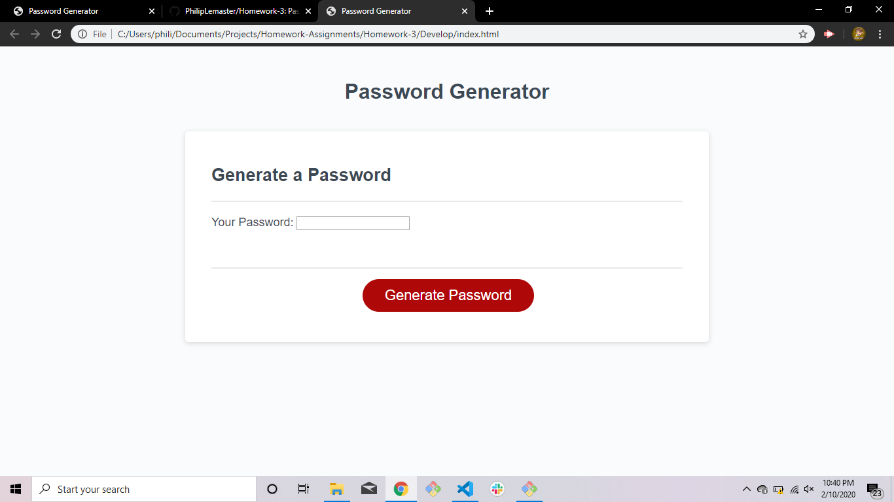

# Homework-3
This is my completed password generator that I created for assignment 3. This assignment required me to develop a functional Javascript process that would enable the user to interactively generate a random password. The final product includes a series of prompts in order to properly assess which characters the user would like to use, as well as the desired password length. These inputs are used to alter variables in the code in order to produce a unique and random password.
This assignment greatly tested my ability to effectively and cleanly develop a working Javascript model that could be initiated by an event and could be carried out with differing results depending on the user's responses.

